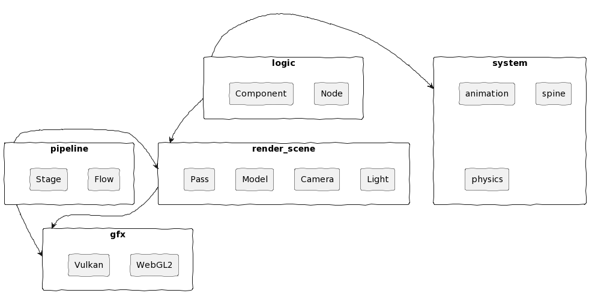

Zero 是一款跨平台 3D 图形引擎

# 跨平台

Web (webgl2);

Android, Windows (vulkan);

IOS, Mac (还没有 metal 实现).

# 功能

3D 模型渲染 (gltf);

冯氏光照与阴影 (shadow map);

动画混合 (一维);

蒙皮动画;

骨骼动画 (spine);

物理引擎 (ammo).

# showcase (web)

[Animation Blend](https://qingwabote.github.io/zero/projects/animation/web/index.html)

[Shadow Map](https://qingwabote.github.io/zero/projects/shadow/web/index.html)

[Skinned Mesh](https://qingwabote.github.io/zero/projects/skin/web/index.html)

[Spine](https://qingwabote.github.io/zero/projects/spine/web/index.html)

[Physics](https://qingwabote.github.io/zero/projects/vehicle/web/index.html)

# architecture



# v8 inspector

```
devtools://devtools/bundled/js_app.html?v8only=true&ws=127.0.0.1:6086
```
